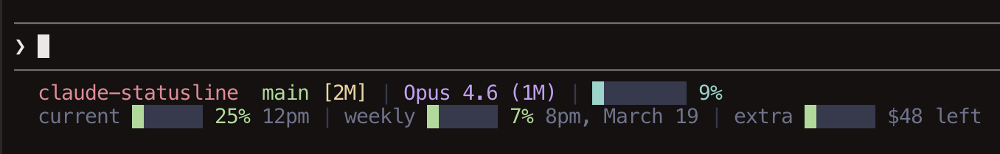
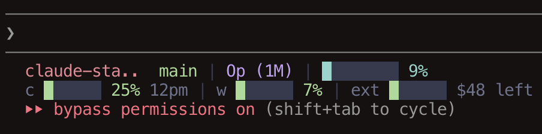
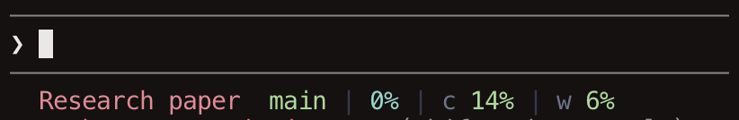
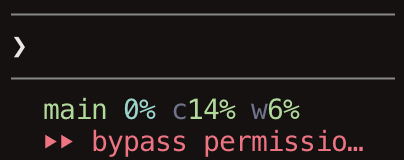

# claude-statusline

A width-adaptive status line for Claude Code that shows model, context usage, rate limits, git info, and extra usage budget. Automatically adjusts its layout based on available terminal width.

### Full (wide terminals, 2 lines)

Project name, branch, diffs, full model name, context gauge bar, usage gauges with reset times, and extra budget.



### Compact (narrower terminals, 2 lines)

Truncated project name, tiny model, context gauge bar, and abbreviated usage gauges.



### Narrow (small terminals, 1 line)

Short project name, tiny model, color-coded percentages with dividers.



### Ultracompact (smallest terminals, 1 line)

Branch, model, and percentages with no dividers.



## Features

- Catppuccin Macchiato color theme
- Background-colored gauge bars (no Unicode width glitches)
- Git branch and diff stats (modified, added, deleted files)
- Context window usage with color-coded thresholds
- 5-hour and weekly rate limit tracking with reset times
- Extra usage budget shown as "$X left"
- Model name with context window size
- Project name with smart truncation for long names
- Cached OAuth usage API calls (60s TTL)

## Install

```bash
npx @ckeith26/claude-statusline
```

Backs up your existing status line (if any), copies the script to `~/.claude/statusline.sh`, and configures your Claude Code settings.

## Requirements

- [jq](https://jqlang.github.io/jq/) for parsing JSON
- curl for fetching rate limit data
- git for branch info

On macOS:

```bash
brew install jq
```

## Uninstall

```bash
npx @ckeith26/claude-statusline --uninstall
```

Restores your previous status line from backup, or removes the script and cleans up settings.

## License

MIT
